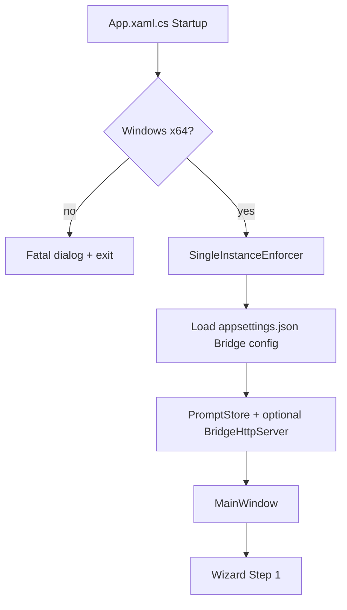
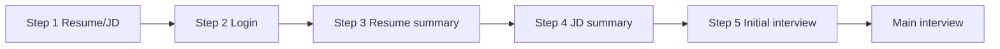
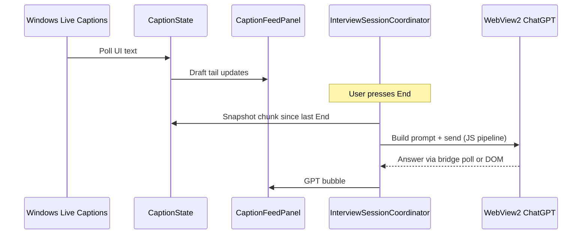

# Interview Assistant — C# project workflow

End-to-end guide for **building**, **running**, and **using** the WPF app in `c#project/`. For a short README, see [README.md](README.md).

---

## Prerequisites

| Requirement | Notes |
|-------------|--------|
| **Windows 10/11 x64** | App is not cross-platform. |
| **[.NET 8 SDK](https://dotnet.microsoft.com/download/dotnet/8.0)** | Build and `dotnet run`. |
| **[WebView2 Runtime](https://go.microsoft.com/fwlink/p/?LinkId=2124703)** | Embedded ChatGPT pane; usually preinstalled. |
| **Windows Live Captions** | Used during main interview for speech-to-text. |

Optional:

- **OCR** — text snip uses Windows OCR when available.
- **HTTP bridge** — optional extension polling (`appsettings.json`, `IA_ENABLE_BRIDGE=1`).

---

## Build and run (developer)

```powershell
cd "D:\AI\Auto Script\Interview-assistant\c#project"
dotnet build
dotnet run --project src/InterviewAssistant.App
```

**Bash (Git Bash / WSL path to Windows SDK):**

```bash
cd "/d/AI/Auto Script/Interview-assistant/c#project"
dotnet build
dotnet run --project src/InterviewAssistant.App
```

**Output (Debug):**

`src/InterviewAssistant.App/bin/Debug/net8.0-windows10.0.19041.0/InterviewAssistant.App.exe`

Close a running instance before rebuilding if the linker reports a locked `.exe`.

---

## Publish (single-file, other PCs)

```powershell
cd "D:\AI\Auto Script\Interview-assistant\c#project"
.\publish.ps1
```

| Output | Description |
|--------|-------------|
| `publish/win-x64/InterviewAssistant.App.exe` | Self-contained ~75 MB; no .NET install on target PC. |
| `publish/win-arm64/` | `.\publish.ps1 -Runtime win-arm64` for ARM laptops. |

Target PC still needs **WebView2 Runtime**. Logs: `InterviewAssistant-startup.log` next to the exe or `%TEMP%\InterviewAssistant\startup.log`.

---

## Solution layout

```
c#project/
├── InterviewAssistant.sln
├── publish.ps1
├── WORKFLOW.md          ← this file
├── README.md
└── src/
    ├── InterviewAssistant.App/     WPF UI, wizard, WebView2, interview loop
    ├── InterviewAssistant.Bridge/    Optional local HTTP bridge
    └── InterviewAssistant.Core/     Shared JSON DTOs
```

---

## Application startup



1. **Single instance** — second launch closes the previous process (unless `IA_REPLACE_INSTANCE=1`).
2. **Bridge** — started only if `Bridge:StartAtLaunch` is `true` or `IA_ENABLE_BRIDGE=1` (default in repo: **off**).
3. **MainWindow** — wizard at **Step 1**; WebView2 created lazily; interview hotkeys registered at load.

---

## Wizard workflow (prep → interview)

| Step | UI title / purpose | User action | What the app does |
|------|-------------------|-------------|-------------------|
| **1** | Resume & Job Description | Paste resume + JD, **Next** | Saves text via `ResumeJdStore`; does **not** start captions. |
| **2** | Login to ChatGPT | Log in in embedded WebView; **Next** (blocked until composer ready) | Polls ChatGPT DOM for login/composer; overlay blocks clicks until ready. |
| **3** | Resume summary | **Send** (prep) | Builds prompt from `Assets/prompt_resume_summary.txt`, sends into ChatGPT via `GptSendPipeline.js`. |
| **4** | JD summary | **Send** (prep) | Same for `Assets/prompt_jd_summary.txt`. |
| **5** | Initial interview | **Send** (prep) | Same for `Assets/prompt_initial_interview.txt`. |
| **Main** | Live interview | Use captions + modes + **End** | 30% caption panel / 70% ChatGPT; starts `InterviewSessionCoordinator`. |



**Skip:** Step 2 may show **Skip** (advance without login gate).

**Restart** (top bar, hidden on Step 1):

- Returns to **Step 1**
- **Keeps** resume/JD text and **does not reload** WebView2 / ChatGPT tab
- Stops interview, clears captions/history, resets mode to **Read**

---

## Main interview workflow



### Entering main mode

When wizard reaches **Main**, `EnterMainInterviewMode()`:

1. Loads resume/JD from `ResumeJdStore`
2. Restarts **LiveCaptions.exe** (best-effort)
3. Starts `LiveCaptionsCaptureService` polling
4. Registers global **End** / **Delete** hooks
5. Shows session mode bar (Read, Type, Error, Behavioral, Closing)

### Leaving main mode

`LeaveMainInterviewMode()` or **Restart** → stop capture, clear captions, hide interview top bar.

---

## Hotkeys

| Key / combo | When active | Action |
|-------------|-------------|--------|
| **End** | Main interview | Send current caption **chunk** to GPT (mode-specific prompt). Cooldown ~0.8s. |
| **Delete** | Main interview | Skip pending draft text without sending to GPT. |
| **Ctrl+Insert** | Main interview | Image snip → attach to ChatGPT composer. |
| **Ctrl+Home** | Main interview | Text snip (OCR) → composer. |

Opacity / click-through / capture-stealth toggles are in the top bar (not global hotkeys).

---

## Session modes

Select a segment in the interview top bar before pressing **End**. Prompt templates live in `Assets/` and `%USERPROFILE%\.interview_assistant\mode_prompts.json`.

| Mode | Use when | `{cleaned_interviewer_intent}` |
|------|----------|--------------------------------|
| **Read** | General technical Q&A | Current chunk since last **End** |
| **Type** | Live coding / typing / diagram | Current chunk; output uses `[SAY-n]`, `[READ-n]`, `[TYPE-n]` line-by-line |
| **Error** | Compile/runtime errors, failing tests | Current chunk; **full corrected code** + `[SAY-n]` script (no line-by-line TYPE) |
| **Behavioral** | STAR / teamwork / conflict | Current chunk |
| **Closing** | “Any questions for us?” | **Full session transcript** from session start |

Edit prompts: **Settings** (gear) → nav item per mode. Seed files:

- `Assets/mode_prompts.seed.json` — read, type, behavioral
- `Assets/closing_mode_prompt.txt`
- `Assets/error_mode_prompt.txt`

---

## Caption chunk model (End / Delete)

Caption edit / endpoint behavior:

- **`full`** = archived fixed text + live window (`_refinedFullCaption`)
- **`index`** = start of unsent **draft** in `full`
- **End** → snapshot `full[index..]`, send to GPT, advance `index`
- **Delete** → archive skip without GPT, advance `index`

Debug logging: set `IA_CAPTION_LOG=1` → `%TEMP%\InterviewAssistant\caption.log`.

---

## GPT send path

1. `ChunkPromptBuilder` substitutes `{cleaned_interviewer_intent}` into the active mode template.
2. `MainWindow` runs `GptSendPipeline.js` in WebView2 to paste/send into ChatGPT.
3. If bridge is enabled, coordinator may poll `GET /latest-answer` for extension-supplied answers.

Prep wizard sends (steps 3–5) use prep templates from `Assets/`:

- `Assets/prompt_resume_summary.txt`
- `Assets/prompt_jd_summary.txt`
- `Assets/prompt_initial_interview.txt`

---

## Configuration and data on disk

| Location | Purpose |
|----------|---------|
| `src/InterviewAssistant.App/appsettings.json` | `Bridge:Host`, `Bridge:Port` (default `127.0.0.1:1212`), `StartAtLaunch` |
| `%USERPROFILE%\.interview_assistant\webview2_gpt_profile` | Persistent ChatGPT login/session |
| `%USERPROFILE%\.interview_assistant\mode_prompts.json` | User-edited mode prompts |
| `%USERPROFILE%\.interview_assistant\` | Resume/JD store (via `ResumeJdStore`) |
| `%TEMP%\InterviewAssistant\` | Startup + caption diagnostic logs |

### Environment variables

| Variable | Effect |
|----------|--------|
| `IA_CAPTION_LOG=1` | Caption boundary debug log |
| `IA_OPAQUE_WINDOW=1` | Disable window transparency (GPU workaround) |
| `IA_ENABLE_BRIDGE=1` | Start HTTP bridge at launch |
| `IA_DISABLE_BRIDGE=1` | Force bridge off |
| `IA_REPLACE_INSTANCE=1` | Kill previous instance on start |

---

## Settings UI (main interview)

From **Main** only:

- Edit prep templates and mode prompts
- **Back** returns to caption + GPT split
- Saving mode prompts writes `mode_prompts.json`

---

## Optional local bridge

When enabled, `InterviewAssistant.Bridge` exposes HTTP routes for optional answer polling:

| Method | Path |
|--------|------|
| GET | `/ping`, `/health`, `/next-prompt`, `/latest-answer`, `/context` |
| POST | `/ack` |

Default port **1212** (`Bridge:Port` in `appsettings.json`).

---

## Typical session checklist

1. **Build/run** the app.
2. **Step 1** — paste resume + JD → **Next**.
3. **Step 2** — log into ChatGPT in embedded pane → **Next**.
4. **Steps 3–5** — run prep sends (optional but recommended).
5. **Main** — open Windows **Live Captions**; pick mode; listen; press **End** after each interviewer turn.
6. Use **Type** while coding, **Error** when something breaks, **Closing** before Q&A at end.
7. **Restart** to prep again without losing resume/JD or ChatGPT login.

---

## Troubleshooting

| Problem | Try |
|---------|-----|
| Build: file locked | Close `InterviewAssistant.App.exe` |
| WebView blank | Install WebView2 Runtime |
| Step 2 Next disabled | Finish ChatGPT login; wait for composer detection |
| No captions | Ensure Live Captions is running; check caption log with `IA_CAPTION_LOG=1` |
| GPT not answering | Confirm send in WebView; enable bridge if you rely on polling |
